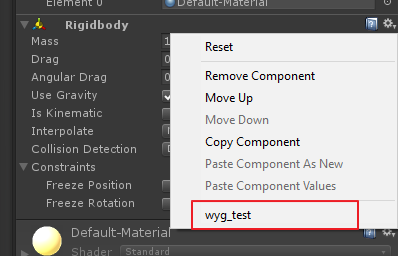
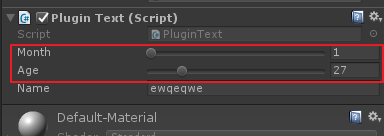
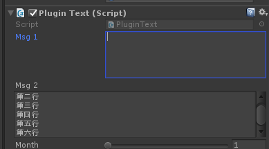
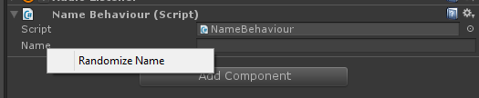
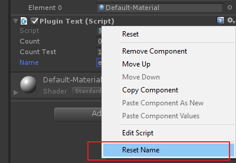

# Unity3D编辑器插件扩展和组件扩展

## 1. 插件扩展

### 1.1. 命名空间

```csharp
using UnityEditor;
using UnityEngine;    //非必需，常用到
```

### 1.2. 使用语法

```csharp
[MenuItem("Assets/My Test")]
private static void Test()
{
    Debug.Log("Hello World!")
}
```

语法说明

```csharp
[MenuItem("path $t", Is, Priority)]
private static void Test1()
{}

[MenuItem("path _t", Is, Priority)]
private static void Test2()
{}
```

- path 是菜单路径；
    - 一级菜单名称不支持中文
- $t 是一个快捷键实例，在路径后面接空格，然后加上快捷键表示，单纯的一个按键快捷键按键字符前带下划线。该项非必需
    - `%` 表示 `ctrl`
    - `#` 表示 `shift`
    - `&` 表示 `alt`
- Is 设置为true的时候，如果没有选中游戏对象，会显示不可用状态，该选项非必需
- Priority 是优先级，数值越小优先级越高，非必需，其默认值为1000。

下面表示快捷键为"ctrl+h" 的实例。

```csharp
[MenuItem("Assets/My Test %h")]
private static void Test()
{
    Debug.Log("Hello World!")
}
```

### 1.3. Selection类

https://docs.unity3d.com/ScriptReference/Selection.html

#### 1.3.1. 获取选中物体

`Selection.Objects`可以获得选中的物品。

#### 1.3.2. 获取选中目录

```csharp
string[] guids = Selection.assetGUIDs;
foreach ( var id in guids )
{
    string path = AssetDatabase.GUIDToAssetPath(id);
    if(Directory.Exists(path))
    {
        Debug.Log(string.format("Directory {0} exist", path))
    }
}

```

### 1.4. 给控件添加右上角齿轮菜单增加功能

```csharp
[MenuItem("CONTEXT/Rigidbody/wyg_test")]
private static TestRightButton()
{
    Debug.Log("右键测试")
}
```

- CONTEXT 为固定写法；
- Rigidbody 是控件名称，可以修改为其他控件；
- 我使用中文的时候不知道为什么没有显示出来。



### 1.5. 弹窗

编辑器的弹窗类需要继承`EditorWindow`。

使用方法与GUI的使用方法基本一致，有Init，Awake，OnGUI等函数。

```
class TestWindow : EditorWindow
{
    public void Init()
    {
    }

    publick void OnGUI()
    {
        GUILayout.Label("Test Window");
        if (GUILayout.Button("Button"))
        {
            Debug.Log("On Button")
        }
    }
}
```

## 2. 组件属性展示

以下效果都是组件的显示，所以是属于`using UnityEngine;`的。

### 2.1. Range

可以将数值的展示效果变成滑动条效果。

```csharp
[Range(1, 12)]
public int month;
``` 



### 2.2. Multiline/TextArea

控制占用多行显示。

```csharp
[Multiline(5)]
public string msg1;

[TextArea(3,5)]
public string msg2;     // 最少显示三行，最多显示五行
```



### 2.3. ContextMenuItem/ContextMenu

添加右键小菜单，添加一些小功能。

```csharp
[ContextMenuItem("Random", "RandomNumber")]
[ContextMenuItem("Reset", "ResetNumber")]
public int number;

void RandomNumber()
{
    number = Random.Range(0, 100);
}

void ResetNumber()
{
    number = 0;
}
```



还有一个`ContextMenu`的特性，用法类似。

```csharp
public string Name;

[ContextMenu("Reset Name")]
private void ResetName()
{
    Name = "";
}
```



### 2.4. ColorUsage

设置颜色选择器。

```csharp
public Color color1;

[ColorUsage(false)]
public Color color2;        // 没有alpha

[ColorUsage(true, true, 0, 8, 0.125f, 3)]
public Color color3;        // HDR
```